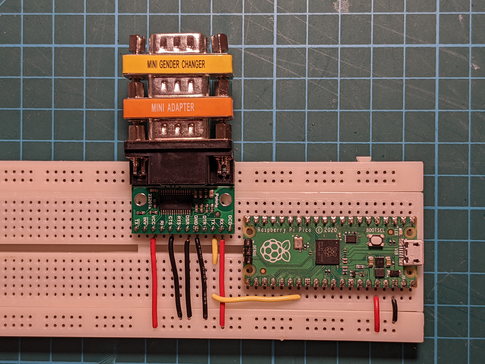

# Serial mouse support

There's a special version of the remapper that takes inputs from a serial mouse and translates them to USB. It's different from most adapters in that they usually only convert RS-232 to USB serial. This converts to USB HID and you can use it even if your operating system doesn't support serial mice at all. The remapping functionality works as usual (there's no polling rate overclocking). Currently only the Microsoft serial mouse protocol is supported.

This version is made using a Raspberry Pi Pico and a [Pololu 23201a Serial Adapter](https://www.pololu.com/product/126). To connect your mouse you're also going to need a null modem adapter and a DB9 gender changer (on the photo below these are two separate adapters, but you can also get one that does both).

The provided [remapper\_serial.uf2](https://github.com/jfedor2/hid-remapper/releases/latest/download/remapper_serial.uf2) file can be used to flash the firmware onto the Pico the usual way (hold BOOTSEL button while connecting to the computer, then copy the UF2 file to the USB drive that shows up).

The pin connections are as follows:

| Pico | serial adapter |
| -----: | ------ |
| 3V3 (pin 36) | VCC |
| 3V3 (pin 36) | RX |
| GND (pin 38) | GND |
| GND (pin 38) | DSR |
| GND (pin 38) | CTS |
| GPIO21 (pin 27) | TX |
